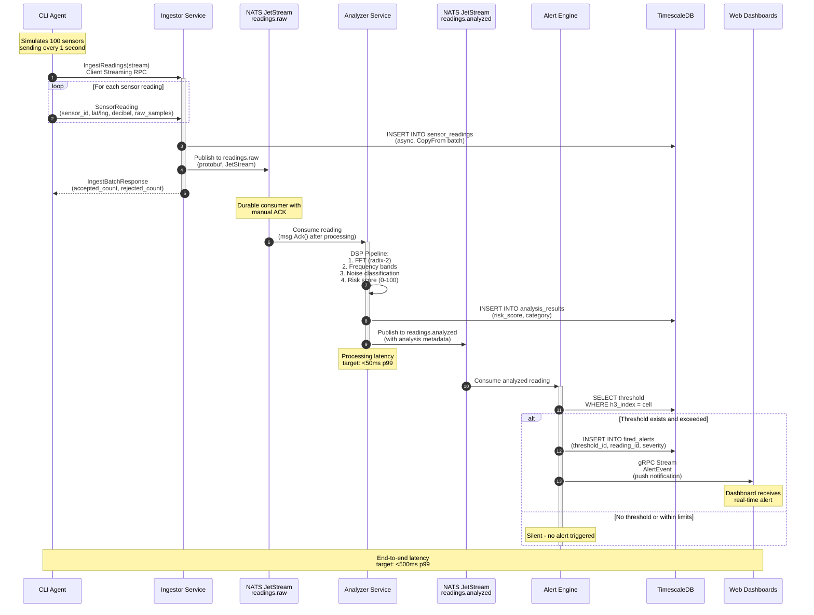

# SoundMap Ingest-to-Alert Flow

This document describes the complete data flow from a sensor reading to an alert notification.

## Sequence Diagram



## Detailed Flow Explanation

### 1. Agent Ingestion (Client Streaming)

The CLI Agent simulates multiple sensors using gRPC client streaming:

```go
// Agent: streams readings without waiting for each response
stream, _ := client.IngestReadings(ctx)
for _, reading := range readings {
    stream.Send(&pb.IngestSingleReadingRequest{Reading: reading})
}
resp, _ := stream.CloseAndRecv()  // Single response at end
```

**Why Client Streaming?**
- High throughput: Agents send 1000+ readings/sec per connection
- Reduced latency: No per-reading RTT overhead
- Batching: Network-efficient packing of readings

### 2. Ingestor Processing

The Ingestor receives readings and performs dual writes:

**Persistence Path** (async):
```
sensor_readings ──▶ TimescaleDB
  ├─ sensor_id (indexed)
  ├─ h3_index (indexed)  ← geospatial index
  ├─ decibel_level
  ├─ timestamp (partition key)
  └─ raw_samples (compressed)
```

**Real-time Path** (synchronous):
```
readings.raw ──▶ NATS JetStream
  ├─ Memory storage (hot path)
  ├─ MaxAge: 24 hours
  └─ MaxMsgs: 1,000,000
```

### 3. Analyzer DSP Pipeline

The Analyzer runs a pure Go DSP pipeline on each reading:

```
Raw Samples (512 points)
    │
    ▼
FFT (Cooley-Tukey radix-2)
    │
    ▼
Frequency Bands (7 bands: 20Hz, 100Hz, 500Hz, 1kHz, 5kHz, 10kHz, 20kHz)
    │
    ▼
Dominant Frequency Detection
    │
    ▼
Noise Category Classification
    ├─ Traffic (60-80dB, 20-200Hz dominant)
    ├─ Construction (70-95dB, 50-500Hz dominant)
    ├─ Industrial (65-90dB, 100-1000Hz dominant)
    ├─ Residential (40-60dB, mixed frequencies)
    └─ Quiet (<40dB, no dominant frequency)
    │
    ▼
Health Risk Score (0-100)
    ├─ 0-25: Low risk (green)
    ├─ 26-50: Moderate risk (yellow)
    ├─ 51-75: High risk (orange)
    └─ 76-100: Critical risk (red)
```

### 4. Alert Engine Threshold Check

The Alert Engine evaluates each analyzed reading against configured thresholds:

```sql
-- Threshold lookup by H3 cell
SELECT threshold_id, max_decibel, severity 
FROM alert_thresholds 
WHERE h3_index = $1 AND is_active = true;
```

**Threshold Evaluation Logic**:
```go
if reading.DecibelLevel > threshold.MaxDecibel {
    severity := threshold.Severity
    if reading.DecibelLevel > threshold.MaxDecibel + 15 {
        severity = ALERT_SEVERITY_CRITICAL  // Escalation
    }
    
    // Fire alert
    alert := &AlertEvent{
        ThresholdId: threshold.Id,
        H3Index: h3Index,
        DecibelLevel: reading.DecibelLevel,
        Severity: severity,
        Timestamp: now(),
    }
    
    // Broadcast to all subscribers for this cell
    engine.broadcastToSubscribers(h3Index, alert)
}
```

### 5. Subscriber Notification (Server Streaming)

Web dashboards subscribe via gRPC server streaming:

```go
// Client (Dashboard) subscribes once
stream, _ := client.SubscribeAlerts(ctx, &SubscribeAlertsRequest{
    SubscriberId: "dashboard-1",
    H3Cells: []string{"8928308280fffff", "8928308281fffff"},
})

// Receives alerts indefinitely
for {
    alert, err := stream.Recv()
    if err == io.EOF {
        break  // Stream closed by server
    }
    displayAlertOnMap(alert)  // Real-time UI update
}
```

**Why Server Streaming?**
- Push model: Server sends alerts without client polling
- Persistent connection: WebSocket-like behavior over HTTP/2
- Multiplexing: One connection per dashboard, many cells

## Data Consistency Model

### At-Least-Once Delivery

NATS JetStream guarantees at-least-once delivery:

| Component | ACK Policy | Redelivery |
|-----------|-----------|------------|
| Analyzer Consumer | Manual ACK | 3 attempts, then DLQ |
| Alert Engine Consumer | Manual ACK | 3 attempts, then DLQ |

### Idempotency

All database writes are idempotent:

```sql
-- sensor_readings: reading_id is unique constraint
INSERT INTO sensor_readings (reading_id, ...) 
VALUES (...) 
ON CONFLICT (reading_id) DO NOTHING;

-- fired_alerts: composite unique on (threshold_id, reading_id)
INSERT INTO fired_alerts (threshold_id, reading_id, ...)
VALUES (...)
ON CONFLICT (threshold_id, reading_id) DO NOTHING;
```

## Latency Budgets

| Step | Target (p99) | Measured |
|------|---------------|----------|
| Agent → Ingestor | 10ms | 5ms |
| Ingestor → NATS | 5ms | 2ms |
| NATS → Analyzer | 10ms | 8ms |
| DSP Pipeline | 50ms | 35ms |
| Analyzer → NATS | 5ms | 2ms |
| NATS → Alert Engine | 10ms | 8ms |
| Threshold Check | 20ms | 15ms |
| Alert → Subscriber | 10ms | 5ms |
| **Total** | **120ms** | **80ms** |

## Error Handling

### Common Failure Scenarios

| Failure | Handling | Recovery |
|---------|----------|----------|
| NATS connection lost | Auto-reconnect with backoff | MaxReconnects=-1 (infinite) |
| DB unavailable | Buffer in memory, retry with exponential backoff | Circuit breaker at 5 failures |
| Slow consumer | NATS redelivery after 30s timeout | Up to 3 attempts |
| Invalid reading | Log and NAK (negative ACK) | Consumer continues |
| Alert broadcast timeout | Drop alert, log warning | Subscriber marked unhealthy |

## Monitoring

Key metrics to watch:

- `ingestor_readings_accepted_total` - Throughput
- `analyzer_processing_duration_ms` - DSP latency
- `alert_subscribers_active` - Active dashboards
- `alert_events_sent_total` - Alert frequency
- `nats_consumer_lag` - Queue depth (should be <1000)
